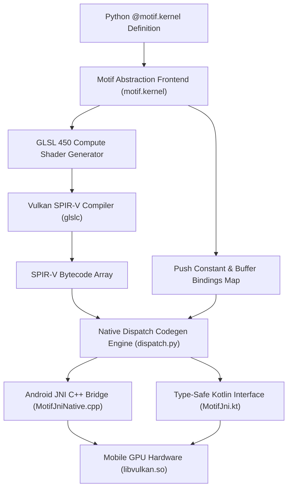

<div align="center">

# Motif v0.1.0

### Python GPU Compute & Shader Abstraction Framework for Mobile Platforms

[](README.md)
[](https://python.org)
[](https://www.vulkan.org)
[-3DDC84.svg?style=for-the-badge&logo=android&logoColor=white)](https://developer.android.com)
[](https://isocpp.org)
[](LICENSE)

</div>

---

## Overview

**Motif** is a high-level abstraction framework designed for authoring, compiling, and executing GPU compute shaders on mobile devices directly from pure Python.

Deploying custom compute workloads to mobile GPUs (e.g. Android hardware over Vulkan) traditionally requires manually maintaining GLSL shader files, configuring low-level Vulkan descriptor sets and pipelines, writing C++ NDK bindings, and stitching JNI wrappers into mobile apps. **Motif** eliminates this friction by providing a unified Python-first abstraction layer for mobile GPU programming.

With **Motif**, developers write compute logic using standard Python syntax and high-level `@motif.kernel` decorators. Motif transparently handles:

1. **Shader Generation**: Compiles high-level Python kernel definitions directly into Vulkan-compliant GLSL 450 compute shader source and SPIR-V bytecode.
2. **Native GPU Dispatch**: Emits zero-overhead native C++ dispatch code built on the lightweight **Kompute** Vulkan framework (`kp::Manager`, `kp::Tensor`, `kp::Algorithm`).
3. **Mobile Bridge Generation**: Auto-generates Android NDK C++ JNI bridge files and type-safe Kotlin interfaces (`MotifJni.kt`) for seamless mobile application integration.

Motif ships with a feature-packed **Android 15 (API 35)** Jetpack Compose showcase application demonstrating GPU-accelerated machine learning (Logistic Regression), an interactive GLSL shader editor with live compilation presets, and real-time CPU vs. GPU matrix multiplication benchmark harnesses.

---

## 🏗 Architecture & Kernel Pipeline



---

## 🚀 Key Features

- **Python-First Mobile GPU Programming**: Write mobile GPU compute kernels using pure Python syntax (`range`, `global_id`, buffer indexing, push constants) without writing low-level Vulkan boilerplate.
- **Automated Shader Compilation**: Automatically infers storage buffer layout bindings (`layout(set=0, binding=N)`) and packs scalar push constants into GLSL 450 compute shaders.
- **Zero-Overhead Vulkan Execution**: Integrates directly with the embedded **Kompute C++ Vulkan framework** for low-latency hardware queue submission, buffer transfers, and GPU tensor synchronization.
- **Automated Mobile Binding Generator**: `build_kernels.py` automatically generates ready-to-compile C++ JNI native bridges and Kotlin runtime wrappers for mobile apps.
- **Android 15 Showcase Application**:
  - Built with **Jetpack Compose** & **Material 3** enforcing edge-to-edge UI standards on Android 15 (API 35).
  - **3 Interactive Tabs**:
    1. **ML Logistic Regression**: Real-time GPU training of model weights ($W_1, W_2, B$) with live probability prediction sliders.
    2. **GLSL Shader Editor**: Live GLSL code editor with preset chips (Vector Add, Logistic Regression, Matrix Multiply) and hardware latency logging.
    3. **CPU vs. GPU Benchmark**: High-throughput $256 \times 256$ Matrix Multiplication benchmark displaying execution latency, GFLOPS throughput metrics, and speedup ratios.

---

## 📁 Project Structure

```
Motif/
├── motif/                         # Core Abstraction & Codegen Framework
│   ├── types.py                   # Buffer & scalar dtype abstraction markers
│   ├── frontend.py                # Python kernel visitor & GLSL generator
│   └── dispatch.py                # SPIR-V compiler & C++ Kompute JNI generator
├── examples/                      # Python Kernel Definitions
│   ├── vecadd.py                  # Vector Addition kernel (@motif.kernel)
│   └── matmul.py                  # Matrix Multiplication kernel (@motif.kernel)
├── shaders/                       # Reference Ground-Truth GLSL Shaders
│   ├── vecadd.comp                # Reference 1D Vector Addition compute shader
│   └── matmul.comp                # Reference 2D Tiled Matrix Multiplication shader
├── third_party/
│   └── kompute/                   # Embedded C++ Kompute Vulkan Compute Framework
├── examples/android/              # Mobile Android 15 Demonstration Application
│   ├── build_kernels.py           # Kernel compilation CLI tool
│   └── app/src/main/
│       ├── cpp/                   # Native NDK Source & CMake Configuration
│       │   ├── CMakeLists.txt     # Android NDK CMake build configuration
│       │   ├── MotifJniNative.cpp # JNI Native entry points & Vulkan loader initialization
│       │   └── generated/         # Auto-generated C++ JNI dispatches (vecadd, matmul, logistic)
│       └── java/org/motif/example/
│           ├── MainActivity.kt    # 3-Tab Jetpack Compose Material 3 UI
│           ├── MotifJni.kt        # Auto-generated Kotlin JNI interface & ML model runner
│           ├── MotifEngine.kt     # High-level Motif Tensor API bridge
│           └── MotifTensor.kt     # High-level multidimensional Tensor wrapper
├── test_codegen.py                # Comprehensive kernel abstraction test suite
├── CMakeLists.txt                 # Host C++ CMake build file
└── README.md                      # Project documentation
```

---

## Kernel Programming Model

Motif defines a safe, intuitive subset of Python designed for GPU compute kernels on mobile hardware:

| Python Construct | Generated GLSL Output | Mobile GPU Semantics |
| :--- | :--- | :--- |
| `Buffer` | `layout(set = 0, binding = N) buffer Buf { float data[]; };` | Vulkan Storage Buffer (SSBO) |
| `int`, `float` | `layout(push_constant) uniform PushConsts { ... };` | Low-latency Push Constants |
| `motif.global_id(0)` | `gl_GlobalInvocationID.x` | 1D dispatch index (`local_size_x = 256`) |
| `motif.global_id(1)` | `gl_GlobalInvocationID.y` | 2D dispatch index (`local_size = (16, 16)`) |
| `for i in range(N):` | `for (int i = 0; i < N; i++) { ... }` | Static/bounded loop for reductions |
| `if cond:` | `if (cond) { ... }` | Conditional execution (bounds checking) |
| `+=`, `*=`, `=`, `+`, `-`, `*`, `/` | Native GLSL arithmetic operators | GPU SIMD arithmetic statements |

---

## Quickstart Guide

### 1. Requirements

- Python 3.8+
- C++17 compliant compiler (`g++` or `clang++`)
- `glslc` or `glslangValidator` (from Vulkan SDK)
- Android Studio / NDK r26+ (for Android deployments)

### 2. Writing a Mobile GPU Kernel in Python

Define your compute shader using standard Python functions decorated with `@motif.kernel`:

```python
import motif
from motif import Buffer

@motif.kernel
def vecadd(a: Buffer, b: Buffer, out: Buffer, n: int):
    idx = motif.global_id(0)
    if idx < n:
        out[idx] = a[idx] + b[idx]

if __name__ == "__main__":
    # Inspect generated GLSL 450 shader
    print(vecadd.glsl)
```

Run the kernel script to inspect the generated GLSL compute shader:

```bash
PYTHONPATH=. python3 examples/vecadd.py
```

Output:

```glsl
#version 450
layout(local_size_x = 256, local_size_y = 1, local_size_z = 1) in;

layout(set = 0, binding = 0) buffer Param_a { float a[]; };
layout(set = 0, binding = 1) buffer Param_b { float b[]; };
layout(set = 0, binding = 2) buffer Param_out { float out_buf[]; };

layout(push_constant) uniform PushConsts {
    int n;
} p;

void main() {
    int idx = int(gl_GlobalInvocationID.x);
    if (idx < p.n) {
        out_buf[idx] = a[idx] + b[idx];
    }
}
```

### 3. Running Verification Suite

Verify the kernel abstraction frontend and C++ Kompute dispatch codegen:

```bash
PYTHONPATH=. python3 test_codegen.py
```

Output:

```
-- vecadd --
[PASS] 1D dispatch
[PASS] local_size_x = 256
[PASS] buffer order/bindings a=0,b=1,out=2
[PASS] scalar push-constant: n
...
-- matmul --
[PASS] 2D dispatch
[PASS] local_size 16x16
...
ALL PASS
```

---

## 📱 Mobile Deployment (Android)

To compile Python GPU kernels for mobile execution on Android:

### 1. Compile Kernels to Native JNI & Kotlin

Run the kernel compilation script to produce native C++ and Kotlin bindings:

```bash
python3 examples/android/build_kernels.py
```

This generates:
- `examples/android/app/src/main/cpp/generated/motif_vecadd.cpp`
- `examples/android/app/src/main/cpp/generated/motif_matmul.cpp`
- `examples/android/app/src/main/cpp/generated/motif_logistic.cpp`
- `examples/android/app/src/main/java/org/motif/example/MotifJni.kt`

### 2. Mobile App Features Overview

| Screen Tab | Functionality | Key Highlights |
| :--- | :--- | :--- |
| **ML Logistic** | Train Logistic Regression Model | Interactive sliders for dataset ($X_i, X_j, Y$), iteration count, and learning rate. Displays live weights ($W_1, W_2, B$), loss, and interactive prediction probability indicator. |
| **GLSL Editor** | Live GLSL Shader Execution | Multi-line code editor pre-loaded with Vector Add, Logistic Regression, and MatMul shader presets. Runs custom or preset GLSL on Vulkan GPU with latency reporting. |
| **CPU vs GPU** | Matrix Multiplication Benchmark | Computes $256 \times 256$ matrix multiplication on CPU vs. Motif GPU. Displays latency (ms), throughput (GFLOPS), correctness check, and speedup highlight card. |

---

## Roadmap & Future Releases

- [x] **v0.1.0**: Core Python mobile GPU abstraction framework, `vecadd` / `matmul` / `logistic` kernels, Kompute JNI codegen, 3-tab Android 15 Jetpack Compose application.
- [ ] **v0.2.0**:
  - Support for `else` branching and multi-conditional activation functions (ReLU, LeakyReLU, Sigmoid).
  - Multi-dtype buffer support (`int32`, `uint32`, `float16` / FP16 precision).
  - Built-in vector math intrinsics (`dot`, `exp`, `log`, `sigmoid`, `tanh`, `clamp`).
- [ ] **v0.3.0**:
  - Shared memory allocation (`workgroup` memory arrays) and barrier synchronization (`barrier()`).
  - Automatic workgroup tiling and memory coalescing optimizer.

---

## 📄 License

This project is licensed under the **MIT License** — see the [LICENSE](LICENSE) file for details.

---

<div align="center">
  <sub>Built with ❤️ by Chima Emmanuel</sub>
</div>
