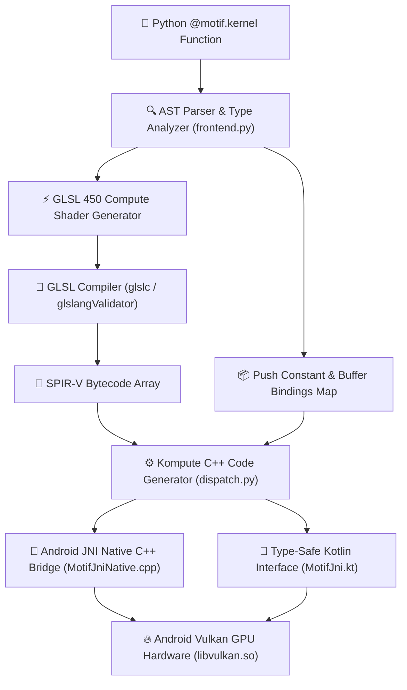

<div align="center">

# Motif v0.1.0

### Lightweight Python-AST-to-GLSL Compiler & Zero-Overhead Vulkan GPU Dispatch Framework

[](file:///home/Ace/gitfiles/Motif/README.md)
[](https://python.org)
[](https://www.vulkan.org)
[-3DDC84.svg?style=for-the-badge&logo=android&logoColor=white)](https://developer.android.com)
[](https://isocpp.org)
[](LICENSE)

</div>

---

## 💡 Overview

**Motif** is a specialized, lightweight domain-specific compiler and native GPU dispatch pipeline designed to bridge Python compute kernels directly to Vulkan GPU compute shaders (GLSL 450 / SPIR-V) and mobile hardware (Android NDK & C++).

Instead of manually maintaining separate GLSL shader files, C++ Vulkan boilerplate, and JNI bindings for Android applications, **Motif** allows developers to write GPU compute kernels in pure Python. The compiler inspects the Python Abstract Syntax Tree (AST), performs type and layout analysis, and automatically generates:

1. **Optimized GLSL 450 Compute Shader Source** (with SSBO layout bindings and packed uniform push constants).
2. **Zero-Overhead Native C++ Dispatch Code** targeting the **Kompute GPU Framework** (`kp::Manager`, `kp::Tensor`, `kp::Algorithm`).
3. **Android JNI C++ Bridge & Type-Safe Kotlin Interfaces** (`MotifJni.kt`) for seamless mobile deployment.

Motif v0.1.0 ships with a complete, modernized **Android 15 (API 35)** Jetpack Compose showcase application demonstrating GPU-accelerated machine learning (Logistic Regression), an interactive GLSL shader editor with presets, and real-time CPU vs. GPU matrix multiplication benchmark harnesses.

---

## 🏗️ Architecture & Compilation Pipeline



---

## 🚀 Key Features

- **Pure Python AST Frontend**: Define GPU kernels cleanly with `@motif.kernel` decorators using Python syntax (`range`, `global_id`, buffer indexers, push constant scalars).
- **GLSL 450 Code Generation**: Generates standard Vulkan GLSL compute shader source code with automatically assigned storage buffer bindings (`layout(set=0, binding=N)`).
- **Vulkan Kompute Integration**: Integrates directly with the embedded lightweight Kompute C++ engine for low-latency Vulkan queue submission, memory synchronization, and tensor management.
- **Automated JNI & Kotlin Code Generation**: `build_kernels.py` auto-compiles Python kernels into ready-to-build C++ JNI bridge files and Kotlin wrappers.
- **Modernized Android 15 Showcase App**:
  - Built with **Jetpack Compose** & **Material 3** enforcing edge-to-edge UI compliance on Android 15 (API 35).
  - **3 Interactive Tabs**:
    1. **🤖 ML Logistic Regression Model**: Vulkan GPU training of weights $W_1, W_2$ and bias $B$ with real-time probability prediction sliders.
    2. **⚡ GLSL Shader Editor**: Live GLSL shader source code editor with preset chips (Vector Add, Logistic Regression, Matrix Multiply) and GPU execution log output.
    3. **📊 CPU vs. GPU Benchmark**: High-throughput $256 \times 256$ Matrix Multiplication benchmark displaying execution latency, GFLOPS metrics, speedup multipliers, and correctness verification checks.

---

## 📁 Directory Structure

```
Motif/
├── motif/                         # Core Compiler Engine
│   ├── types.py                   # Buffer type markers & scalar dtype registration
│   ├── frontend.py                # Python AST visitor (ast.FunctionDef -> GLSL source)
│   └── dispatch.py                # GLSL -> SPIR-V & C++ Kompute JNI codegen generator
├── examples/                      # Python Kernel Definitions
│   ├── vecadd.py                  # Vector Addition kernel (@motif.kernel)
│   └── matmul.py                  # Matrix Multiplication kernel (@motif.kernel)
├── shaders/                       # Reference Ground-Truth GLSL Shaders
│   ├── vecadd.comp                # Reference 1D Vector Addition compute shader
│   └── matmul.comp                # Reference 2D Tiled Matrix Multiplication shader
├── third_party/
│   └── kompute/                   # Embedded C++ Kompute Vulkan Compute Framework
├── examples/android/              # Modern Android 15 Demonstration Application
│   ├── build_kernels.py           # Kernel compilation CLI script
│   └── app/src/main/
│       ├── cpp/                   # Native NDK Source & CMake Configuration
│       │   ├── CMakeLists.txt     # Android NDK CMake build configuration
│       │   ├── MotifJniNative.cpp # JNI Native entry points & Vulkan loader initialization
│       │   └── generated/         # Auto-generated C++ JNI dispatches (vecadd, matmul, logistic)
│       └── java/org/motif/example/
│           ├── MainActivity.kt    # 3-Tab Jetpack Compose Material 3 UI
│           ├── MotifJni.kt        # Auto-generated Kotlin JNI interface & ML model runner
│           ├── MotifEngine.kt     # High-level Motif Tensor API bridge
│           └── MotifTensor.kt     # High-level multidimensional Tensor wrapper
├── test_codegen.py                # Comprehensive compiler AST & C++ codegen test suite
├── CMakeLists.txt                 # Host C++ CMake build file
└── README.md                      # Project documentation
```

---

## 🛠️ v0.1.0 Kernel Specification

Motif v0.1.0 defines a focused, safe subset of Python designed for elementwise and matrix compute patterns:

| Python Construct | Generated GLSL 450 Output | Notes / Semantics |
| :--- | :--- | :--- |
| `Buffer` | `layout(set = 0, binding = N) buffer Buf { float data[]; };` | SSBO storage buffer binding |
| `int`, `float` | `layout(push_constant) uniform PushConsts { ... };` | Packed uniform scalar push constants |
| `motif.global_id(0)` | `gl_GlobalInvocationID.x` | 1D dispatch index (`local_size_x = 256`) |
| `motif.global_id(1)` | `gl_GlobalInvocationID.y` | 2D dispatch index (`local_size = (16, 16)`) |
| `for i in range(N):` | `for (int i = 0; i < N; i++) { ... }` | Static range loop for reductions |
| `if cond:` | `if (cond) { ... }` | Single-branch conditional (e.g. bounds check) |
| `+=`, `*=`, `=`, `+`, `-`, `*`, `/` | Native GLSL arithmetic operators | Expression & accumulator statements |

---

## 💻 Quickstart Guide

### 1. Requirements

- Python 3.8+
- C++17 compliant compiler (`g++` or `clang++`)
- `glslc` or `glslangValidator` (from Vulkan SDK)
- Android Studio Ladybug / NDK r26+ (for Android builds)

### 2. Defining & Inspecting a Kernel in Python

Write your compute kernel in standard Python syntax:

```python
import motif
from motif import Buffer

@motif.kernel
def vecadd(a: Buffer, b: Buffer, out: Buffer, n: int):
    idx = motif.global_id(0)
    if idx < n:
        out[idx] = a[idx] + b[idx]

if __name__ == "__main__":
    # Inspect generated GLSL 450 shader
    print(vecadd.glsl)
```

Run the example to print generated GLSL code:

```bash
PYTHONPATH=. python3 examples/vecadd.py
```

Output:

```glsl
#version 450
layout(local_size_x = 256, local_size_y = 1, local_size_z = 1) in;

layout(set = 0, binding = 0) buffer Param_a { float a[]; };
layout(set = 0, binding = 1) buffer Param_b { float b[]; };
layout(set = 0, binding = 2) buffer Param_out { float out_buf[]; };

layout(push_constant) uniform PushConsts {
    int n;
} p;

void main() {
    int idx = int(gl_GlobalInvocationID.x);
    if (idx < p.n) {
        out_buf[idx] = a[idx] + b[idx];
    }
}
```

### 3. Running Test Suite

Verify AST compiler sanity and C++ Kompute code generation:

```bash
PYTHONPATH=. python3 test_codegen.py
```

Expected output:

```
-- vecadd --
[PASS] 1D dispatch
[PASS] local_size_x = 256
[PASS] buffer order/bindings a=0,b=1,out=2
[PASS] scalar push-constant: n
...
-- matmul --
[PASS] 2D dispatch
[PASS] local_size 16x16
...
ALL PASS
```

---

## 📱 Android Application Showcase

The Android example located in `examples/android/` delivers a modern, high-performance Vulkan GPU experience on Android 15.

### Compiling Kernels for Android

To compile all Python kernels into C++ JNI bridge files and Kotlin wrappers:

```bash
python3 examples/android/build_kernels.py
```

This updates:
- `examples/android/app/src/main/cpp/generated/motif_vecadd.cpp`
- `examples/android/app/src/main/cpp/generated/motif_matmul.cpp`
- `examples/android/app/src/main/cpp/generated/motif_logistic.cpp`
- `examples/android/app/src/main/java/org/motif/example/MotifJni.kt`

### Building the Android APK

Build debug APK via Gradle:

```bash
cd examples/android
./gradlew assembleDebug
```

### App Features Overview

| Screen Tab | Functionality | Key Highlights |
| :--- | :--- | :--- |
| **🤖 ML Logistic** | Train Logistic Regression Model | Interactive sliders for dataset ($X_i, X_j, Y$), iteration count, and learning rate. Displays live weights ($W_1, W_2, B$), loss, and interactive prediction probability indicator. |
| **⚡ GLSL Editor** | Live GLSL Shader Execution | Multi-line code editor pre-loaded with Vector Add, Logistic Regression, and MatMul shader presets. Runs custom or preset GLSL on Vulkan GPU with latency reporting. |
| **📊 CPU vs GPU** | Matrix Multiplication Benchmark | Computes $256 \times 256$ matrix multiplication on CPU vs. Motif GPU. Displays latency (ms), throughput (GFLOPS), correctness check, and speedup highlight card. |

---

## 🗺️ Roadmap & Future Releases

- [x] **v0.1.0**: Core AST-to-GLSL compiler, `vecadd` & `matmul` kernels, C++ Kompute JNI codegen, 3-tab Android 15 Jetpack Compose application.
- [ ] **v0.2.0**:
  - Support for `else` branching and multi-conditional logic (e.g. ReLU, LeakyReLU, Activation functions).
  - Multi-dtype buffer support (`int32`, `uint32`, `float16` / FP16 precision).
  - Built-in math intrinsics (`dot`, `exp`, `log`, `sigmoid`, `tanh`, `clamp`).
- [ ] **v0.3.0**:
  - Shared memory allocation (`workgroup` memory arrays) and barrier synchronization (`barrier()`).
  - Automatic workgroup tiling and memory coalescing optimizer.

---

## 📄 License

This project is licensed under the **MIT License** — see the [LICENSE](LICENSE) file for details.

---

<div align="center">
  <sub>Built with ❤️ by the Motif Core Team</sub>
</div>
